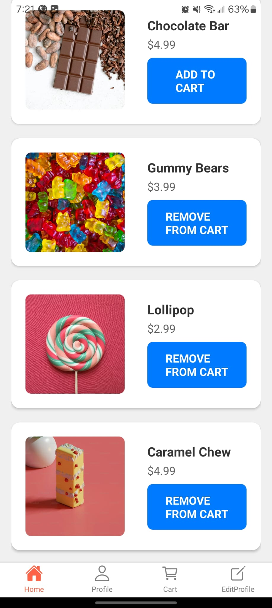
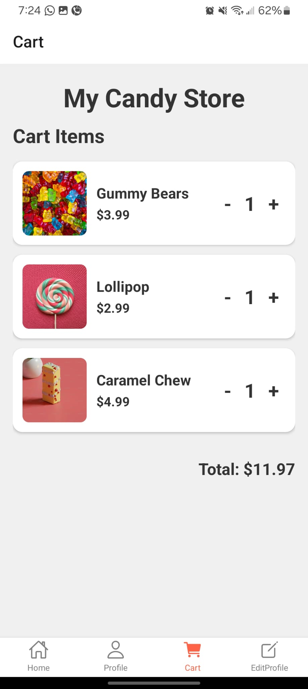
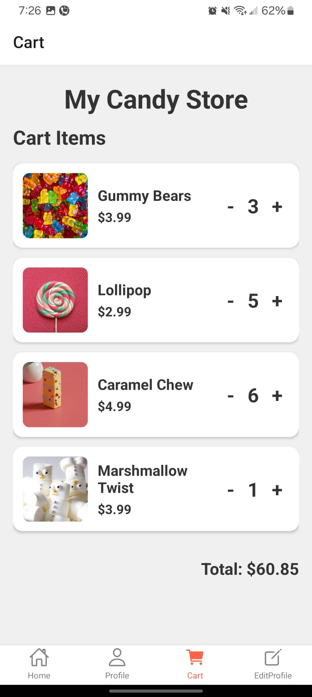
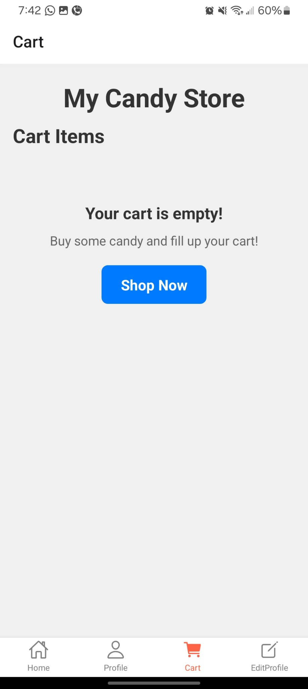
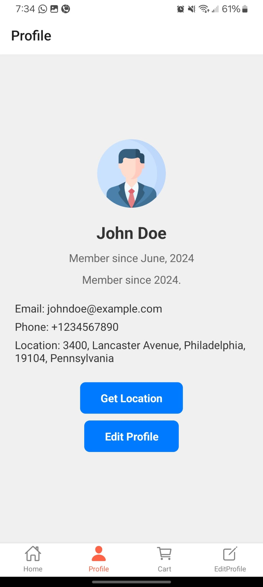
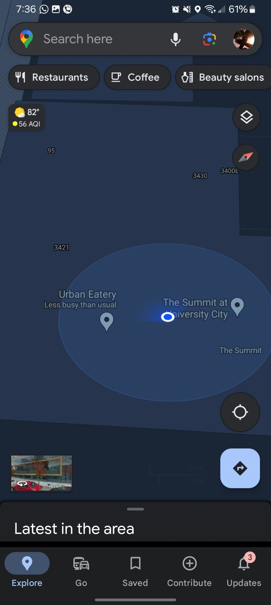
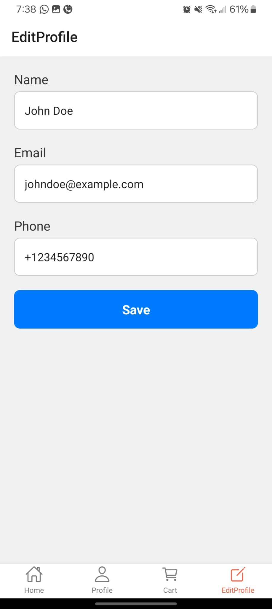
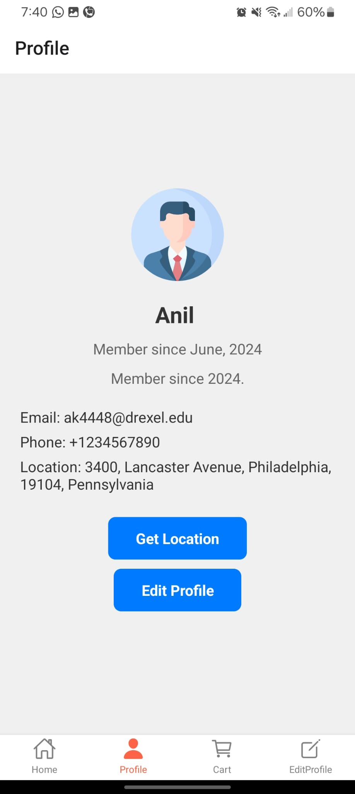
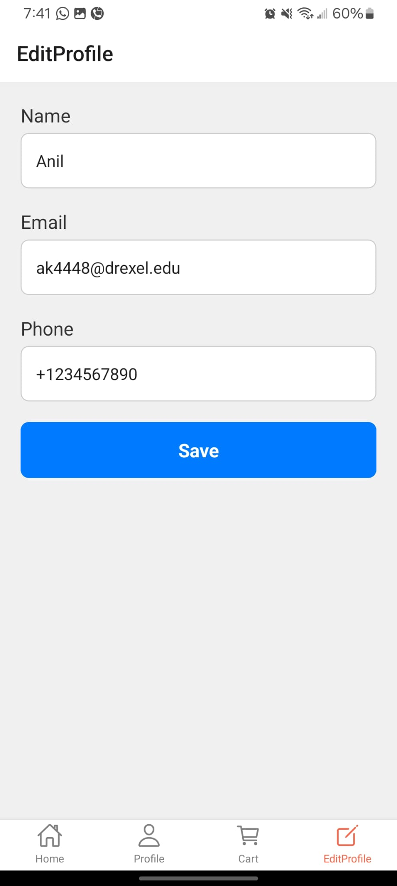
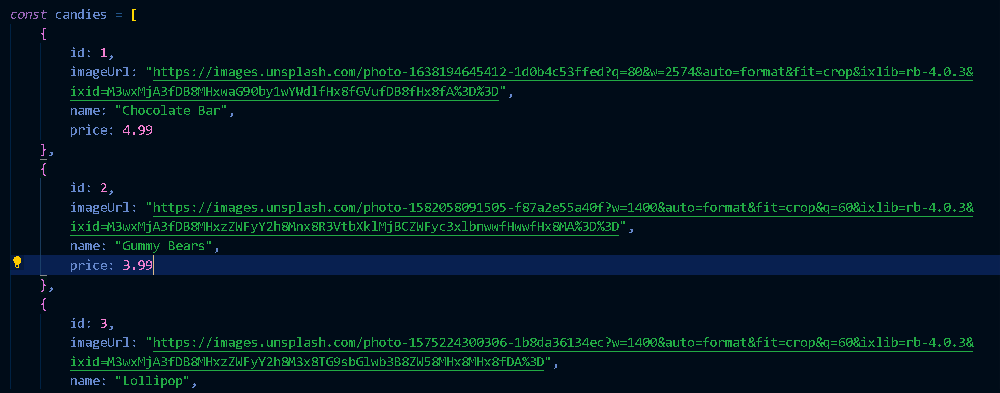

Here's the updated readme with the images formatted as you requested:

## My Candy Shop - Final Read Me

Welcome to My Candy Shop, an online store where you can buy your favorite candies and chocolates. This app serves both vendors and customers, allowing them to sell and purchase items easily. Currently, the focus is on chocolates and candies, but the selection can expand to include any desired items in the future.

### Login Screen

This page welcomes the user and offers options to sign in with Google. However, due to security concerns, Google sign-in is currently disabled. This uses Google's Firebase API and stores the data there. This works similar to our traditional backend but like a NoSQL one.

If "Shop Now" is clicked, you will be directed to the Home Page.

### Home Page

Here, users can add needed items to the cart, and the button changes to 'remove from cart'.

### Cart

Users can navigate to the cart using the tab navigation below. Here redux is used for state management.

Items in the cart can be easily adjusted using the + and - buttons, and the price will update automatically.

If the cart is empty, users are prompted to shop.

### Profile

The profile page displays user information with 'Get Location' and 'Edit Profile' buttons. The "Member Since" data is fetched from the user's local time, and the month and year are added accordingly.

#### Get Location

This button uses the user's current location to retrieve their full address. It was implemented using Google Cloud and Google Maps API. Once clicked, permissions will be requested, and upon approval, the user's current location will be added.

Updated Location - I am working from Urban Eatery, and the exact location was provided.

My current location for proof:

### Edit Profile

Clicking the "Edit Profile" button takes the user to the profile editing screen, where the information is pre-loaded from the Profile page. Here, there are input fields that can be edited.

Once the user updates the information and clicks save, the info will be modified on the Profile page. This is done using 'local storage'

Updated Profile Screen:

Clicking "Edit" again will take the user to the editing page with new prefilled data.

### Data Format and Administration

The app utilizes an array format to display items. This means that administrators can easily add new products by simply updating this array. In the future, we plan to implement an Admin Panel that will allow admins to add items directly without needing to access the code.

## Using the App

Interacting with MyCandyShop is straightforward and user-friendly:

- **Viewing Items**: Upon opening the app, users will see a list of chocolates available for purchase.
- **Adding to Cart**: Each item will have an 'Add to Cart' button. Clicking this button will add the selected chocolate to the user's shopping cart.
- **Managing Cart**: Users can scroll down to view their items in the cart. Here, they can update the quantity of each item or remove items entirely from the cart.
